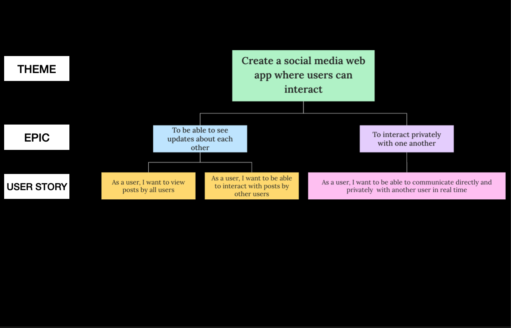
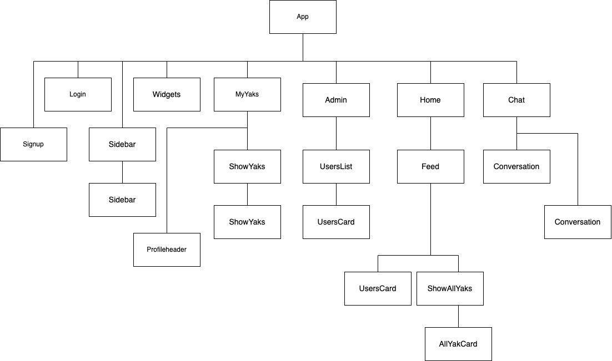

# Yakker

Yakker is a social media web application which facilitates interactions between users. It is inspired by Twitter.

The platform was created for the purpose of allowing users to see updates about each other and to interact privately with one another in real-time. 

## Table of Contents

1. [User Stories](#user-stories)
2. [Wireframes](#wireframes)
3. [Technologies Used](#technologies-used)
4. [Libraries Used](#libraries-used)
5. [Installation Instructions](#installation-instructions)
6. [ReactJS Application Hierarchy](#reactjs-application-hierarchy)
7. [Back-end API Endpoints](#backend-api)
8. [Next Steps](#next-steps)

## User Stories



## Wireframes


## Technologies Used

- ReactJS
- Tailwind CSS
- MongoDB
- Express
- Node
- Socket.io
- BCrypt
- JSONWebToken
- Cloudinary

## Libraries Used

- react-hot-toast
- react-timeago
- react-twitter-embed
- react-input-emoji

## Installation Instructions

For client folder:

```
npm install
npm start
```

For server folder:

```
npm install
npm run dev
```

For socket folder:

```
npm install
npm start
```

## ReactJS Application Hierarchy



## App Demo
https://user-images.githubusercontent.com/108888457/202707444-9a008b47-1145-4b7d-9fde-d6ef08757cd0.mp4


## Back-end API endpoints

- Users

  1. Create new user account
  2. User login
  3. Update user's profile picture
  4. Find all users
  5. Find a user by Id
  6. Delete a user (admin-only endpoint implemented in front end)

- Posts

  1. Create posts
  2. Find all posts
  3. Find user's posts
  4. Delete posts (not implemented in front end yet)

- Comments

  1. Create comment
  2. Find comments
  3. Delete comments (not implemented in front end yet)

- Chats

  1. Create chat
  2. Find user chat
  3. Find chat

- Messages
  1. Add messages
  2. Get messages

## Next Steps

- Implement the ability to follow and unfollow other users

- Implement the like and re-yak function

- Implement the ability to comment on a comment

- Implement content moderation by admin

## Credits

- <a href="https://www.flaticon.com/free-icons/yak" title="yak icons">Yak icons created by Freepik - Flaticon</a>
- <a href="https://www.flaticon.com/free-icons/account" title="account icons">Account icons created by srip - Flaticon</a>
- The Net Ninja on Youtube
- ZAINKEEPSCODE on Youtube
- Pedrotech on Youtube
